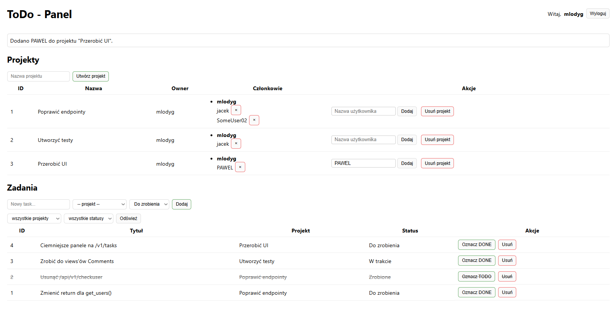
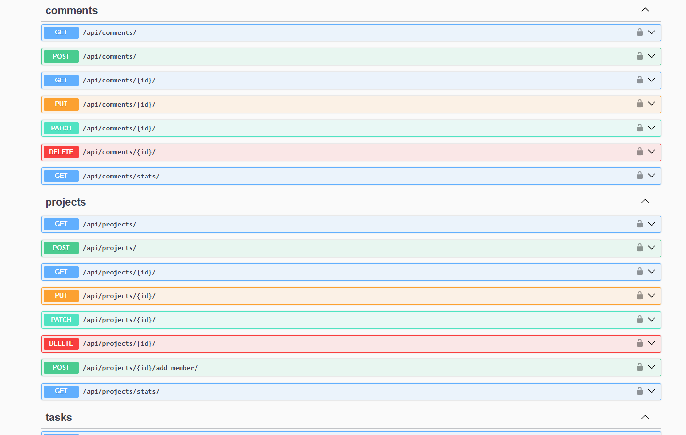

# 📝 Django + HTMX TODO App

Pełnoprawna aplikacja **TODO manager**, zbudowana w **Django** i **Django REST Framework**, z prostym interfejsem w **HTMX** pozwalającym w wygodny sposób przetestować API bez potrzeby pisania osobnego frontendu.

Projekt prezentuje **czysty backend REST API** – z autoryzacją, walidacją i logicznym podziałem kodu – oraz minimalną warstwę wizualną opartą na HTMX.

---

## 🚀 Funkcjonalności

✅ Tworzenie i usuwanie użytkowników  
✅ Tworzenie i usuwanie projektów
✅ Dodawanie oraz usuwanie członków projektu  
✅ Dodawanie i usuwanie zadań (tasków)  
✅ Wykorzystanie **HTMX OOB** do dynamicznego aktualizowania tabel (`<tbody>`, `<td>`)

---

## 🧩 Stack technologiczny

- **Python 3.12+**
- **Django 5.x**
- **DRF 3.15+**
- **HTMX 1.9.x**
- **SQLite** (lokalnie)
- **HTML + Tailwind/inline CSS (minimalne stylowanie)**

---

## ⚙️ Instalacja i uruchomienie lokalne

1️⃣ Sklonuj repozytorium:
```bash
git clone https://github.com/mlodyg2137/TodoProject.git
cd TodoProject
```

2️⃣ Utwórz i aktywuj środowisko:
```bash
python -m venv venv
source venv/bin/activate  # Linux / Mac
venv\Scripts\activate    # Windows
```

3️⃣ Zainstaluj zależności:
```bash
pip install -r requirements.txt
```

4️⃣Wykonaj migracje i uruchom serwer:
```bash
python manage.py migrate
python manage.py runserver
```

5️⃣Otwórz w przeglądarce:
```bash
http://127.0.0.1:8000/
```

## Działanie aplikacji

Poniżej krótki przegląd kluczowych przepływów: **Rejestracja → Logowanie → Panel TODO (projekty, członkowie, zadania)**.  
Ekrany służą jako wizualne uzupełnienie dla **REST API (DRF)** – UI jest warstwą testową.

### 1) Rejestracja


**Opis:** Użytkownik zakłada konto.

---

### 2) Logowanie


**Opis:** Standardowe logowanie; sesja użytkownika wykorzystywana do autoryzacji żądań do API.

---

### 3) Panel TODO (projekty, członkowie, zadania)



W panelu przedstawiam minimalny interfejs bazujący na **HTMX** do szybkiego testowania API. Można tworzyć projekty oraz zadania. Tylko właściciel projektu może zarządzać członkami projektu oraz zadaniami. Członek projektu może tylko oznaczyć dane zadanie jako ukończone.

### 4) Swagger



Pod adresem *127.0.0.1:8000/api/schema/swagger-ui/* można znaleźć wszystkie endpointy aplikacji. Schemat ten jest utworzony przy pomocy **Swagger'a**.

### 🧪 Testy
```bash
pytest -q
```

### 🧾 Licencja
Projekt dostępny na licencji MIT — możesz dowolnie modyfikować i używać w swoich projektach.

### 💬 Kontakt
📧 kamilszpechcinski@gmail.com
💼 https://github.com/mlodyg2137